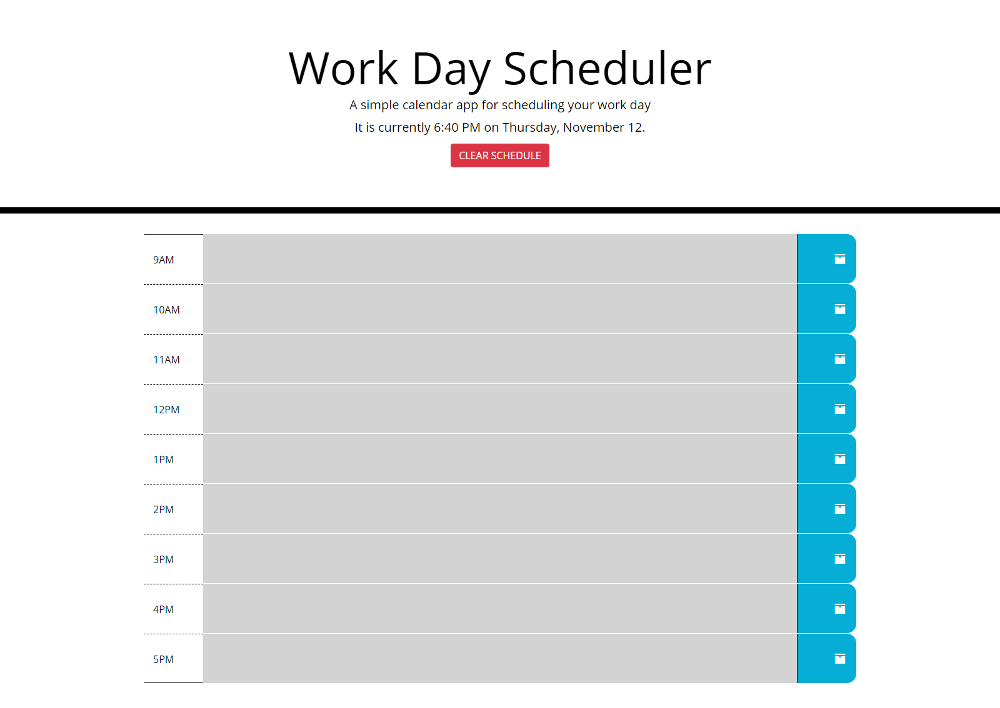

# Work Day Scheduler
## Purpose
Allows the user to save a schedule for a standard 9AM - 5PM work day.

## Contents
1. [Features](#features)
2. [Built With](#built-with)
3. [Web Page](#web-page)
4. [Task List](#task-list)
5. [Contribution](#contribution)

## Features
* Current time updates every minute.
* Tasks are added to the schedule by clicking on the time block.
* Clicking on the save button will save user's tasks in local storage.
* Time blocks are color-coordinated according to past, present, or future hours.
* Task persistence upon refreshing the page.
* "CLEAR SCHEDULE" button clears all tasks, allowing users to start a new day easily.

## Built With
* HTML5
* JavaScript
* JQuery 
* CSS3
* BootStrap 4
* Moment.js

## Web Page

[Deployed Application](https://deckiedevs.github.io/scheduler/)

## Task List
- [ ] Refactor
- [ ] Improve UI/UX

## Contribution
* Starter code provided by [UCF Coding Boot Camp](https://github.com/coding-boot-camp/super-disco).
* Everything else built with some confusion by Mila Decker.